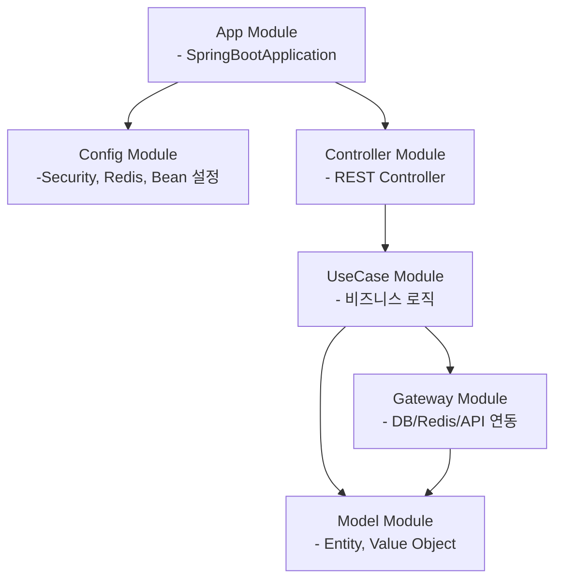
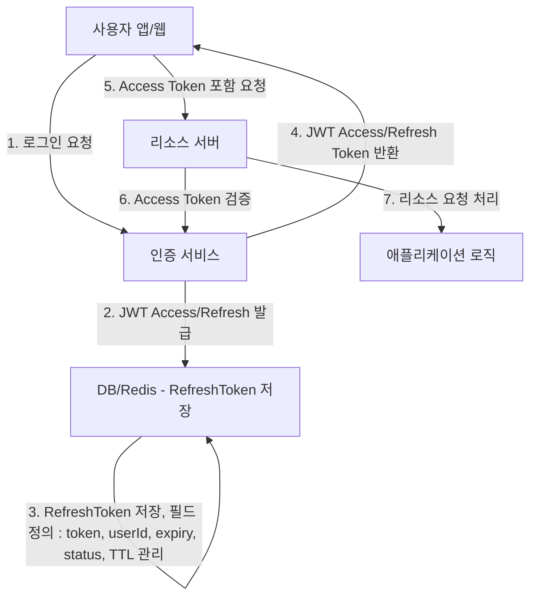

# travel-project

### 1. 프로젝트 개요 

**여행 계획을 짜기 귀찮은 사람을 위해 지역 상품을 추천하는 서비스**
- 랜덤 여행지 추천 
- 지역 상품 추천
- 최근 기록 조회

### 2. 사용된 기술 스택
**[ 백엔드 ]**

- Kotlin (JDK 17+) 
- Spring Boot 3.x
- Spring Security + JWT 
- Spring Data JPA (Hibernate)
- Spring Mail → 알림 메일 발송 외부 결제 연동 (미정)

**[ DB ]**
- MariaDB -> 오픈소스이며 MySQL과 호환 가능.

**[ 캐싱 ]** ( 예정 ) 
- Redis -> 빠른 읽기/쓰기 성능으로 랜덤 추천과 조회 기록 캐싱에 최적화. 

**[ 배포 및 환경 ]**
- Docker -> 환경 간 일관성을 보장하며 배포와 유지보수를 간소화.
- Git action → CI / CD


### 3. 모듈 구조 및 의존성 관계
- 모듈 구조

      com.travel.project
      ┣ 📂 app                      : Spring Boot 애플리케이션 진입점.
      ┣ 📂 config                   : Security, Redis, Bean 설정 등 애플리케이션 구성.
      ┣ 📂 controller               : REST API 엔드포인트 처리.
      ┣ 📂 usecase                  : 비즈니스 로직 캡슐화.
      ┣ 📂 gateway                  : DB, Redis, 외부 API 연동 처리.
      ┗ 📂 model                    : Entity 및 Value Object 정의.

- 모듈간 의존성


### 4. JWT를 활용한 인증 / 인가 프로세스


- 인증 서비스와 리소스 서버 역할은 구분하여 다이어그램에 표시했으나, 실제 구현은 단일 서비스 내에서 처리됩니다.
- Refresh Token 자체가 만료된 경우, 사용자는 다시 로그인해야 합니다.
- Refresh Token 요청도 HTTPS를 통해 암호화되어야 합니다.

**4-1. 초기 로그인 및 토큰 발급 플로우**

- 로그인 실패 시 401 Unauthorized 에러 발생

**4-2. 토큰 만료 후 Refresh 재발급 플로우**
````mermaid
flowchart TD

%% 1. Access Token 만료
   a[사용자 앱/웹] -->|1. Access Token 만료| b[인증 서비스]

%% 2. Refresh Token 요청
   a -->|2. Refresh Token 포함 요청| b

%% 3. Refresh Token 검증
   b -->|3. Refresh Token 검증 - 재사용 감지, 상태 확인| d[DB/Redis - RefreshToken 저장]

%% 4. 새로운 토큰 발급
b -->|4. 새로운 JWT Access/Refresh Token 발급| a

%% 5. DB/Redis 업데이트
d -->|5. 이전 Refresh Token 상태 업데이트 - used/revoked + TTL 갱신| d

````
### 5. 프로젝트 실행 방법 (미완성)

5-1. 프로젝트 다운로드 : https://github.com/DaHee200/travel-project.git

5-2. application run 실행

### 6. Swagger 이용 방법

- Swagger 접근 URL : http://localhost:8080/swagger-ui.html
